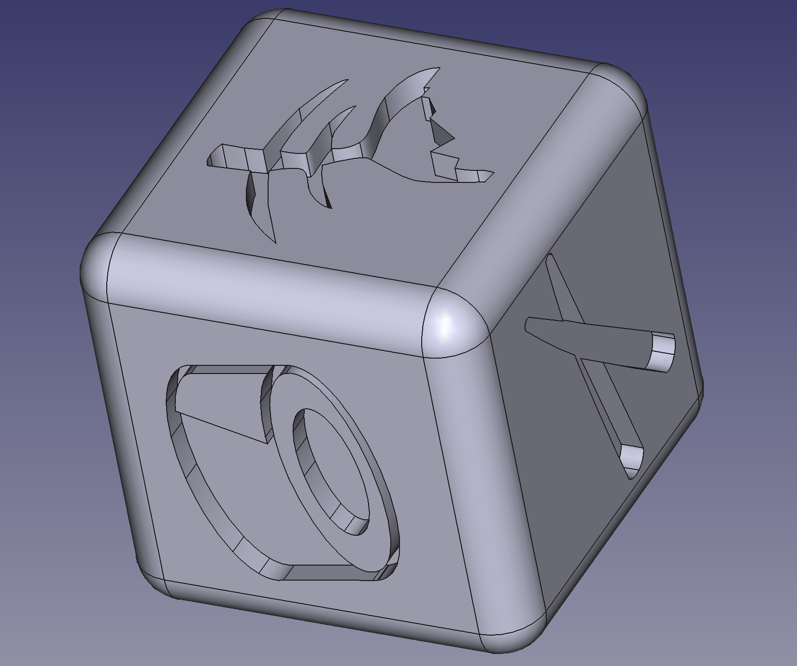

# Sushi Bar Dice

A recreation of the dices for the Sushi Bar board game.

## Changes to the original dice

Compared to the original dice, one of the two sticks faces was modified to
easily distinguish them. This should be useful for colorblind users to
tell apart the two different faces that have different means in-game.

## Software used

- Inkscape for vector graphics
- FreeCAD for 3D modeling

## License

CC-BY-SA.
